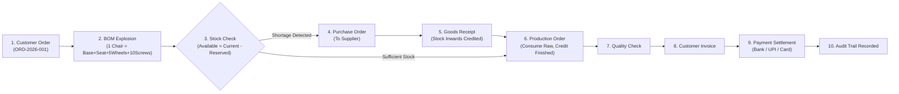

# 🏭 OrderCraft — Manufacturing Order Management System (OMS / ERP)


> **HCLTech Training & Capability Development — Java Full Stack Enterprise Project**  
> OrderCraft is a realistic, production-quality Manufacturing ERP / OMS designed to streamline the entire production lifecycle:  
> **Customers $\rightarrow$ Products $\rightarrow$ BOM $\rightarrow$ Customer Orders $\rightarrow$ Material Requirements (MRP) $\rightarrow$ Inventory $\rightarrow$ Shortage Detection $\rightarrow$ Purchase Orders $\rightarrow$ Suppliers $\rightarrow$ Goods Receipt $\rightarrow$ Production Orders $\rightarrow$ Quality Inspection $\rightarrow$ Invoicing $\rightarrow$ Payments $\rightarrow$ Financial Reports $\rightarrow$ Audit Trail.**

---

## 📁 Repository Directory Structure

The repository is modularly organized for clean separation of concerns and GitHub readiness:

```text
OrderCraft2/
├── .github/
│   └── workflows/
│       └── ci.yml               # GitHub Actions CI (Automated Maven + Angular build)
├── auth/
│   └── README.md                # RBAC permission matrix, JWT security, OAuth2 guide
├── backend/                     # Spring Boot 3.4.3 REST API Service
│   ├── src/                     # Java entity, service, controller, security, DTO code
│   ├── pom.xml                  # Maven dependencies (JPA, MySQL, Security, JJWT)
│   └── mvnw, mvnw.cmd           # Maven wrapper binaries
├── database/                    # Relational Database Schema & Data Assets
│   ├── schema.sql               # Complete MySQL 8 DDL table definitions
│   ├── seed-data.sql            # Master realistic demo records (Users, Products, Orders)
│   └── README.md                # ER Diagram & database restoration guide
├── docs/                        # Project Documentation & Evaluation Materials
│   ├── architecture/            # Architecture diagrams & manufacturing state machine
│   ├── project-report/          # Complete HCLTech Training Project Report (Markdown)
│   ├── presentations/           # Slide-by-slide PPT outline & Viva Q&A preparation
│   └── screenshots/             # Folder for dashboard and module screenshots
├── frontend/                    # Angular 21 Standalone Web Client
│   ├── src/                     # Angular components, signals, forms, interceptors
│   ├── package.json             # NPM dependencies & scripts
│   └── angular.json             # Angular workspace configuration
├── postman/                     # API Testing Suite
│   ├── OrderCraft_API_Collection.postman_collection.json # 50+ pre-scripted API tests
│   └── OrderCraft_Local.postman_environment.json        # Base URL & auto-token environment
├── scripts/                     # One-Click Launch Scripts
│   ├── start-all.bat            # Launches backend & frontend simultaneously
│   ├── start-backend.bat        # Starts Spring Boot server (port 8080)
│   └── start-frontend.bat       # Starts Angular dev server (port 4200)
├── .gitignore                   # Ignores build artifacts, target, node_modules, temp files
└── README.md                    # Master Project Documentation (This file)
```

---

## ⚡ Quick Start Guide

### Prerequisites

- **JDK 21 LTS** installed (`java -version`)
- **Node.js 20+ & npm** installed (`node -v`)
- **MySQL 8.0 Server** running on `localhost:3306`

### 1. One-Click Launcher (Windows)

Double-click `scripts/start-all.bat` to spin up both Backend and Frontend in separate terminals.

---

### 2. Manual Startup

#### Step A: Configure & Start MySQL

Create the database:

```sql
CREATE DATABASE ordercraft CHARACTER SET utf8mb4 COLLATE utf8mb4_unicode_ci;
```

Configure `DB_USERNAME` and `DB_PASSWORD` in your shell for local MySQL credentials. These settings are environment-based; no database password is stored in the repository.

#### Step B: Run Backend (Spring Boot)

```bash
cd backend
./mvnw.cmd spring-boot:run
```

> The API will be live at: **`http://localhost:8080/api`**  
> _(On first boot, `DataInitializer.java` automatically seeds 6 demo accounts, raw materials, BOMs, customers, suppliers, and customer orders)._

#### Step C: Run Frontend (Angular)

```bash
cd frontend
npm install
npm start
```

> The web portal will open at: **`http://localhost:4200`**

---

## 🚀 Deploy on Render and Vercel

See [`docs/deployment/render-vercel.md`](docs/deployment/render-vercel.md) for the Render Docker backend, Vercel Angular frontend, external MySQL setup, and required environment variables.

## 🔐 Credentials & Role-Based Access Control (RBAC)

The login screen features one-click demo role switches. You can also sign in manually with any of the accounts below:

| Role                    | Username      | Password    | Permitted Modules & Operations                            |
| :---------------------- | :------------ | :---------- | :-------------------------------------------------------- |
| **ADMIN**               | `admin`       | `Admin@123` | Full access across all 15 modules & user administration   |
| **SALES_MANAGER**       | `sales`       | `Admin@123` | Customers, Customer Orders, Sales Reports                 |
| **PRODUCTION_MANAGER**  | `production`  | `Admin@123` | Products, BOM Recipes, Production Floor Orders, MRP       |
| **PROCUREMENT_MANAGER** | `procurement` | `Admin@123` | Material Shortages, Suppliers, Purchase Orders            |
| **WAREHOUSE_MANAGER**   | `warehouse`   | `Admin@123` | Inventory Stock Levels, Stock Adjustments, Goods Receipts |
| **FINANCE_MANAGER**     | `finance`     | `Admin@123` | Billing Invoices, Payment Receipts, Cash-flow Reports     |

---

## 🧪 Postman API Verification

1. Open **Postman**.
2. Click **Import** $\rightarrow$ select both files in `postman/`:
   - `OrderCraft_API_Collection.postman_collection.json`
   - `OrderCraft_Local.postman_environment.json`
3. Select the **OrderCraft Local Environment** in the top-right environment selector.
4. Execute **Authentication $\rightarrow$ Login as Admin**:
   - The test script automatically saves the returned JWT token to your `{{token}}` variable.
5. All subsequent requests automatically inject the `Authorization: Bearer {{token}}` header.

---

## 📦 Manufacturing Value Stream Workflow



---

## 🎓 HCLTech Training Submission Kit

All files required for evaluation, project defense, and viva are packaged in `docs/`:

1. **Project Report**: [`docs/project-report/HCL_Training_Project_Report.md`](docs/project-report/HCL_Training_Project_Report.md)
   _(Complete academic documentation covering Abstract, Problem Statement, Feasibility, Architecture, Modules, Data Dictionary, Testing, and Conclusion)._
2. **Presentation Deck & Viva Guide**: [`docs/presentations/Presentation_Deck_Outline.md`](docs/presentations/Presentation_Deck_Outline.md)
   _(Slide-by-slide presentation outline and top technical viva questions with model answers)._
3. **Architecture Blueprints**: [`docs/architecture/Architecture_and_Workflows.md`](docs/architecture/Architecture_and_Workflows.md)
   _(System interaction sequences, ER model, and manufacturing state machines)._

---

## 🚀 Pushing to Git / GitHub

To push this organized repository to your GitHub account:

```bash
# 1. Initialize git repository (if not already done)
git init

# 2. Add all structured directories
git add .

# 3. Commit with a descriptive message
git commit -m "feat: complete OrderCraft manufacturing OMS with separated backend, frontend, database, docs, and postman suite"

# 4. Link your remote GitHub repository
git remote add origin https://github.com/<your-username>/OrderCraft.git

# 5. Push to main branch
git branch -M main
git push -u origin main
```
