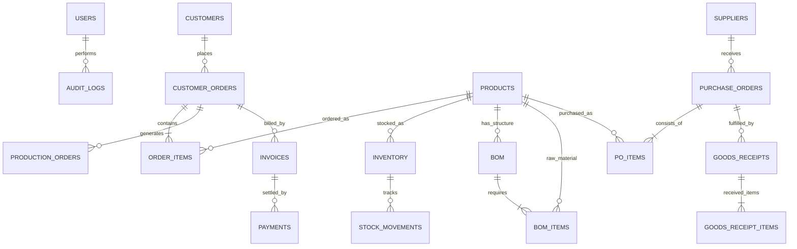

# 🗄️ Database Documentation

OrderCraft uses **MySQL 8.0** with InnoDB storage engine, complete with foreign key constraints, indexes, unique keys, and UTF8MB4 encoding.

---

## 1. Quick Setup & Restore

### A. Fresh Setup via MySQL CLI
```bash
# Log into MySQL
mysql -u root -p

# Create database
CREATE DATABASE ordercraft CHARACTER SET utf8mb4 COLLATE utf8mb4_unicode_ci;
exit;

# Restore schema and seed records
mysql -u root -p ordercraft < database/schema.sql
mysql -u root -p ordercraft < database/seed-data.sql
```

### B. Automated Schema Creation (Hibernate)
When the Spring Boot application boots with:
```properties
spring.jpa.hibernate.ddl-auto=update
```
Hibernate will automatically create and synchronize all tables matching the JPA entities.

---

## 2. Entity-Relationship Overview



---

## 3. Core Tables Summary

| Table | Description | Key Relationships |
|:------|:------------|:------------------|
| `users` | System accounts & roles | `role` (ADMIN, SALES, etc.) |
| `customers` | Client organizations & contacts | FK in `customer_orders` |
| `products` | Finished goods and raw materials | Type: `FINISHED_GOOD` / `RAW_MATERIAL` |
| `inventory` | Stock level tracking per product | `current_qty`, `reserved_qty`, `available_qty` |
| `stock_movements`| Ledger of every physical inventory change | Type: `IN`, `OUT`, `RESERVED`, `RELEASED`, `ADJUSTMENT` |
| `boms` & `bom_items` | Multi-level Bill of Materials | Maps finished goods to raw materials + scrap % |
| `customer_orders` & `order_items` | Sales orders | Status lifecycle (DRAFT -> CONFIRMED -> READY -> IN_PROD -> COMPLETED) |
| `suppliers` | Raw material vendors | FK in `purchase_orders` |
| `purchase_orders` & `po_items` | Procurement orders | Triggered by material shortage calculation |
| `goods_receipts` & `goods_receipt_items`| Warehouse inwards verification | Auto-updates stock levels & movements |
| `production_orders` | Manufacturing execution | Consumes raw materials & credits finished goods |
| `invoices` | Billing documents | Tied to completed customer orders |
| `payments` | Customer settlements | Prevents payment > outstanding balance |
| `audit_logs` | Immutable audit trail | User, action, entity, timestamp, before/after values |
