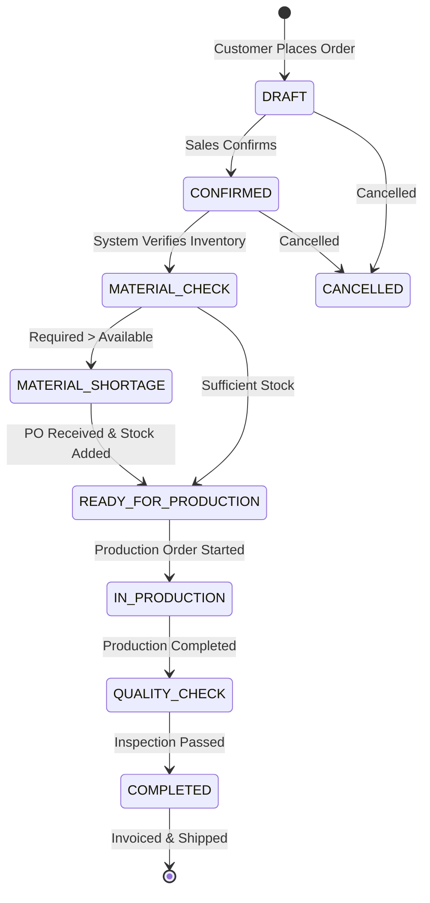
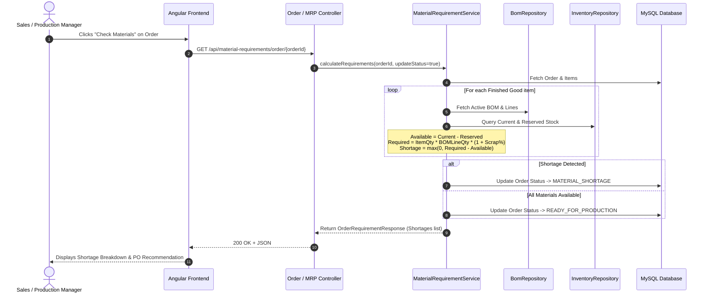

# 📐 System Architecture & Workflow Specifications

This document outlines the architectural blueprints, subsystem interaction sequences, and lifecycle state machines governing OrderCraft.

---

## 1. Manufacturing Lifecycle State Machine

---

## 2. Material Requirements Planning (MRP) Flow

---

## 3. Subsystem Architecture

```mermaid
graph LR
    subgraph Frontend ["Client Layer (Angular 21)"]
        Components["Standalone Components<br/>(Dashboard, Orders, BOM, Invoices)"]
        Services["Signals Services & State<br/>(AuthService, ApiService, ToastService)"]
        Interceptors["Functional HTTP Interceptor<br/>(Bearer Token Injection & 401/403 Handling)"]
    end

    subgraph Backend ["Backend API Layer (Spring Boot 3)"]
        Security["Spring Security Filter Chain<br/>(JwtAuthTokenFilter, CORS, BCrypt)"]
        Controllers["REST API Controllers<br/>(DTO Binding, Bean Validation)"]
        ServiceLayer["Transactional Services<br/>(MRP, Inventory, Order State Machine)"]
        DAOLayer["Spring Data JPA Repositories<br/>(Hibernate ORM, JPQL Queries)"]
    end

    subgraph Storage ["Persistence Layer"]
        MySQL[("MySQL 8.0 Engine<br/>InnoDB, UTF8MB4, ACID")]
    end

    Components --> Services
    Services --> Interceptors
    Interceptors -->|REST / JSON| Security
    Security --> Controllers
    Controllers --> ServiceLayer
    ServiceLayer --> DAOLayer
    DAOLayer --> MySQL
```

---

## 4. Key Business Invariants & Rules

1. **Non-Negative Inventory**: No operation can deduct stock below zero. An adjustment or consumption that violates this condition throws a transactional `BadRequestException`.
2. **Payment Bounds**: Recorded payments cannot exceed the current outstanding balance ($\text{Grand Total} - \text{Paid Amount}$). Once paid amount equals grand total, invoice status automatically updates to `PAID`.
3. **BOM Versioning**: A product may have multiple BOM versions, but only one active version per product may be used for material requirement explosion at any given time.
4. **Audit Trail**: Every high-impact event (`ORDER_CREATED`, `STATUS_CHANGED`, `INVENTORY_ADJUSTED`, `PAYMENT_RECEIVED`) writes an immutable record to the `audit_logs` table.
