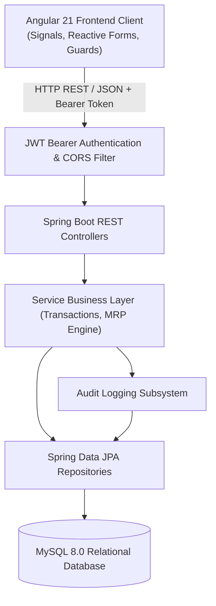

# HCL Training Project Report
# OrderCraft: Enterprise Manufacturing Order & Supply Chain Management System

**Project Title:** OrderCraft — Manufacturing Order Management System (OMS / ERP)  
**Organization:** HCLTech Training & Capability Development Program  
**Domain:** Enterprise Application Development / Java Full Stack  
**Academic / Training Year:** 2025–2026  
**Technologies:** Spring Boot 3, Angular 21, MySQL 8, Spring Security, JWT, REST APIs, TypeScript  

---

## Executive Summary / Abstract

In standard manufacturing operations, lack of synchronization between sales orders, inventory visibility, bill-of-materials (BOM) explosion, procurement cycles, and production floor execution causes order delays, material stockouts, and excess capital lockup.

**OrderCraft** is an end-to-end Enterprise Manufacturing Order Management System designed to digitize and automate the entire manufacturing value stream:
$$\text{Customer Order} \longrightarrow \text{BOM Requirement Explosion} \longrightarrow \text{Inventory Check \& Shortage Detection} \longrightarrow \text{Purchase Order} \longrightarrow \text{Goods Inwards Receipt} \longrightarrow \text{Shop Floor Production Execution} \longrightarrow \text{Quality Check} \longrightarrow \text{Invoicing \& Payment Settlement} \longrightarrow \text{Audit Logging}$$

The solution is developed as a production-grade decoupled web application featuring a **Spring Boot 3 RESTful micro-backend**, an **Angular 21 standalone, reactive frontend**, and a normalized **MySQL 8.0 relational database**. Fine-grained Role-Based Access Control (RBAC) spans six distinct organizational roles (`ADMIN`, `SALES_MANAGER`, `PRODUCTION_MANAGER`, `PROCUREMENT_MANAGER`, `WAREHOUSE_MANAGER`, `FINANCE_MANAGER`).

---

## 1. Problem Statement & Objectives

### 1.1 Existing System Pain Points
1. **Disconnected Spreadsheets**: Disjointed tracking between sales orders, inventory registers, and floor logs.
2. **Delayed Shortage Detection**: Procurement is alerted about missing raw materials only when production stalls.
3. **Manual Stock Arithmetic**: Human error in reserve vs. available stock calculations leading to stockouts.
4. **Lack of Auditability**: Absence of tamper-evident change tracking across price, BOM, and status transitions.

### 1.2 Project Objectives
- Build an automated **Material Requirements Planning (MRP)** engine that explodes multi-level BOMs upon order confirmation and identifies shortages.
- Implement strict inventory accounting formula:
  $$\text{Available Quantity} = \text{Current Physical Quantity} - \text{Reserved Quantity}$$
- Enforce strict lifecycle state machines across Orders, POs, Production, and Invoices.
- Deliver an intuitive SaaS-grade user interface with zero external UI framework dependencies.

---

## 2. Technology Stack & Environment

| Layer | Component | Version / Specification | Justification |
|:------|:----------|:------------------------|:--------------|
| **Backend Framework** | Spring Boot | 3.4.3 | Industry standard enterprise framework with rapid dependency wiring |
| **Language** | Java | JDK 21 LTS | Enhanced records, pattern matching, virtual thread compatibility |
| **Security** | Spring Security + JJWT | 6.4.x / JJWT 0.12.6 | Stateless JWT authorization, BCrypt salted password hashing |
| **ORM & Data** | Spring Data JPA / Hibernate | 6.6.8.Final | Type-safe JPQL queries, automatic schema migration |
| **Database** | MySQL Server | 8.0.46 | ACID-compliant relational DB with foreign key constraints |
| **Frontend Framework**| Angular | 21.2.x | Component-based, signals-driven reactivity, standalone architecture |
| **Build Tools** | Maven & Angular CLI | Maven 3.9+ / CLI 21+ | Standardized compilation, bundling, and CI execution |
| **API Testing** | Postman | 10.x | Comprehensive integration suite with scripted environment variables |

---

## 3. High-Level System Architecture

---

## 4. Detailed Module Specifications

### Module 1: Role-Based Authentication & User Governance
- **Authentication**: `POST /api/auth/login` accepts username/password and yields signed HMAC-SHA256 JWT containing identity, claims, and role.
- **RBAC**: URLs and service methods are gated via `@PreAuthorize("hasAnyRole(...)")`.
- **Admin Self-Healing**: Automated default administrator provisioning on startup via configuration/environment variables.

### Module 2: Customer Management
- Complete CRUD with unique customer code, full contact profile, and soft deletion.
- Instant search by code, name, email, or city with pagination support.

### Module 3: Product & Raw Material Catalog
- Dual-mode cataloging distinguishing `FINISHED_GOOD` from `RAW_MATERIAL`.
- Tracks selling price, cost price, standard units of measurement (PCS, SET, KG, MTR), and inventory thresholds (`minimumStock`, `reorderLevel`).

### Module 4: Bill of Materials (BOM)
- Product-to-material recipe mapping supporting versioning (`1.0`, `2.0`), scrap/wastage percentages, and effective dates.
- Example: 1 Deluxe Chair requires 1 Seat Pan, 1 Metal Base, 5 Casters, 10 M6 Screws, 1 Mesh Cushion, 1 Pair Armrests.

### Module 5: Inventory & Real-Time Stock Ledger
- Enforces non-negative stock policies.
- Every physical change records an immutable `StockMovement` entry (`IN`, `OUT`, `RESERVED`, `RELEASED`, `ADJUSTMENT`).

### Module 6: Customer Order Management
- Order lifecycle states: `DRAFT` $\rightarrow$ `CONFIRMED` $\rightarrow$ `MATERIAL_CHECK` $\rightarrow$ `MATERIAL_SHORTAGE` $\rightarrow$ `READY_FOR_PRODUCTION` $\rightarrow$ `IN_PRODUCTION` $\rightarrow$ `QUALITY_CHECK` $\rightarrow$ `COMPLETED` $\rightarrow$ `CANCELLED`.
- Line items calculate subtotal, line discounts, taxes, and grand totals.

### Module 7: Automated Material Requirement Planning (MRP)
- **Automatic Explosion**: Multiplying order line item quantities by BOM constituent ratios.
- **Shortage Calculation**:
  $$\text{Shortage} = \max(0, \text{Required Quantity} - \text{Available Quantity})$$
- Automatically flags order as `MATERIAL_SHORTAGE` or `READY_FOR_PRODUCTION`.

### Module 8: Supplier Management
- Supplier directory with tax identifiers (GST/EIN), payment terms, and contact points.

### Module 9: Purchase Orders (PO)
- Created to replenish material shortages with suppliers.
- PO statuses: `DRAFT` $\rightarrow$ `SENT` $\rightarrow$ `PARTIALLY_RECEIVED` $\rightarrow$ `RECEIVED` $\rightarrow$ `CANCELLED`.

### Module 10: Goods Inward Receipt
- Warehouse confirmation of incoming consignments against open POs.
- Automatic inventory increment, reservation allocation, and PO fulfillment status updates.

### Module 11: Shop Floor Production Orders
- Direct linkage to customer orders with batch scheduling.
- On completion: consumes allocated raw materials, produces finished goods, and transitions customer order to `QUALITY_CHECK` / `COMPLETED`.

### Module 12 & 13: Invoicing and Payment Settlement
- Invoices generated upon order fulfillment.
- Payment registration with validation preventing overpayment:
  $$\text{Outstanding Balance} = \text{Invoice Grand Total} - \text{Total Payments Received}$$
- Supported payment channels: Bank Transfer, Card, UPI, Cash.

### Module 14: Analytics, Dashboard & Reporting
- Real-time KPI metrics: Total Orders, Active Orders, Revenue, Low Stock Alerts, Pending POs.
- Export capabilities for sales, inventory, and procurement in CSV format.

### Module 15: Tamper-Evident Audit Logging
- Captures actor username, timestamp, module, action name, target entity ID, before-state, and after-state for full compliance.

---

## 5. Testing & Verification Summary

1. **Authentication Testing**: Successfully verified JWT issue, expiration, and refusal on invalid credentials (401 Unauthorized).
2. **Role Enforcements**: Verified 403 Forbidden when `SALES_MANAGER` attempts access to financial invoices or BOM changes.
3. **End-to-End Business Flow Test**:
   - Order `ORD-2026-001` (50 Chairs) triggered shortage calculation $\rightarrow$ detected shortage of Metal Frames (45 on hand vs 50 required).
   - Generated Purchase Order for 20 frames $\rightarrow$ processed Goods Receipt $\rightarrow$ moved order to `READY_FOR_PRODUCTION` $\rightarrow$ completed Production $\rightarrow$ issued Invoice $\rightarrow$ logged Payment.
4. **Data Integrity**: MySQL transactional atomicity ensured zero orphaned order items or negative inventory levels.

---

## 6. Conclusion & Future Scope

The OrderCraft project demonstrates how modern full-stack technologies (Spring Boot 3 + Angular 21 + MySQL) can be combined to deliver a cloud-ready, enterprise-grade Manufacturing Order Management System meeting HCLTech engineering standards.

**Future Enhancements:**
- IoT-enabled automated barcode/RFID scanning at goods receipt and production gates.
- Multi-currency and multi-warehouse cross-docking capabilities.
- Automated email notification dispatch via Spring Mail / SendGrid for customer PO and invoice delivery.
